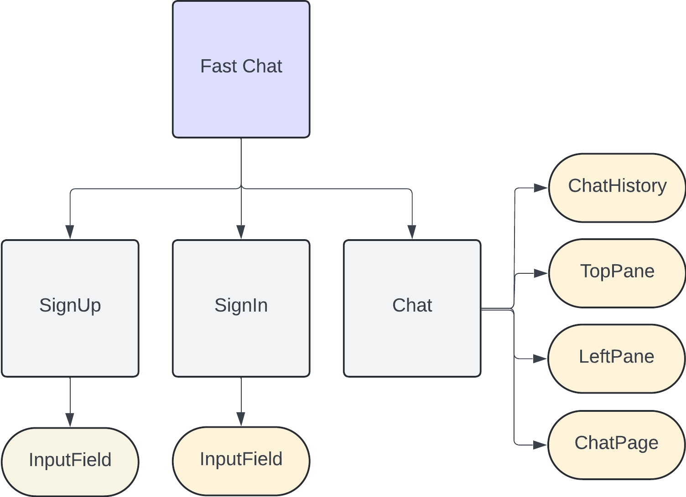

# FAST CHAT
## About
**Name** : Shubham Kumar Maurya\
**College Name** : Indian Institute of Technology Jammu\
**Branch Name** : Computer Science and Engineering\
**Year of Study** : 3rd Year
## Project Detail
I have developed a chat application using Next.js for the frontend, styled with Tailwind CSS, and Django with SQLite for the backend. This application allows new users to sign up, create accounts, and add other users to their contact list. It also supports real-time chat, enabling users to send and receive messages instantly, making communication seamless and responsive.
## Setup
To set up the project, follow these steps:
1. Clone the repository using 
```
git clone https://github.com/your-username/your-repository-name.git
```
2. Navigate to the project directory using 
```
cd fast_chat
```
3. Open the frontend directory and install required NodeJs dependencies
```
cd fast_chat_frontend
npm install
```
4. Open the backend directory and install required Python dependencies
```
cd fast_chat_backend    
pip install -r requirements.txt 
```
5. Create a new SQLite database in the backend directory using 
```
python manage.py makemigrations 
python manage.py migrate
```
6. Run the Django development server using
```
python manage.py runserver  
```
7. Run the frontend application using
```
npm run dev
``` 
## Architecture
The project is divided into two main parts: the frontend and the backend. The frontend is built using NextJs while the backend is built on Django. Backend sotres data on the default SQLite database.\
The NextJs frontend is composed of multiple pages and components. The components tree for the same is
<div style="text-align: center;">
    
</div>
The Django backend is composed of multiple models and views. The models are used to define the data. The flowchart of the application is 
<div style="text-align: center;">
    
</div>
The complete architecture of the application composed of all the frontend, backend, database and APIs is shown below 
<div style="text-align: center;">
    
</div> 

## Usage
1. Open a web browser and navigate to `http://localhost:3000` to access the chat application, the signup page will appear <br/> <br/>
 <br/> <br/><br/> <br/>
2. Fill in the required details and click on the signup button to create a new account
3. After signing up, you will be redirected to the login page. Enter your credentials to login<br/> <br/>
<br/> <br/><br/> <br/>
4. Once logged in, you can view your contact list and add new contacts<br/> <br/>
<br/> <br/><br/> <br/>
5. You can add users to your contact list by entering their username<br/> <br/>
<br/> <br/><br/> <br/>
6. After adding a user to your contact list, you can initiate a chat with them by clicking on their card<br/> <br/>
<br/> <br/><br/> <br/>
7. You can send messages to the user you are chatting with, and they will receive the messages<br/> <br/>
<br/> <br/><br/> <br/>
8. Enjoy your chatting on **Fast Chat**

## Conclusion
Fast Chat is a simple chat application that allows users to create an account, login, add contacts,  initiate chats, and send messages. The application is built using NextJs for the frontend and Django for the backend. The application uses SQLite as the default database. The application is easy to use and has a simple user interface. The application can be extended to include more features such as file sharing, voice and video calls, and more. The application can also be deployed on a cloud platform such as Heroku or AWS.


